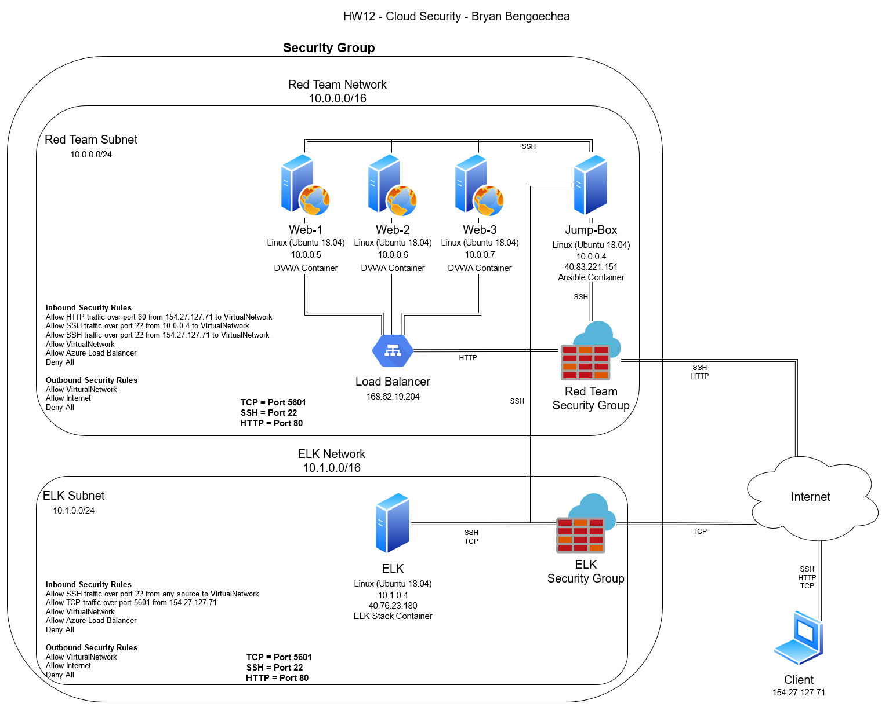
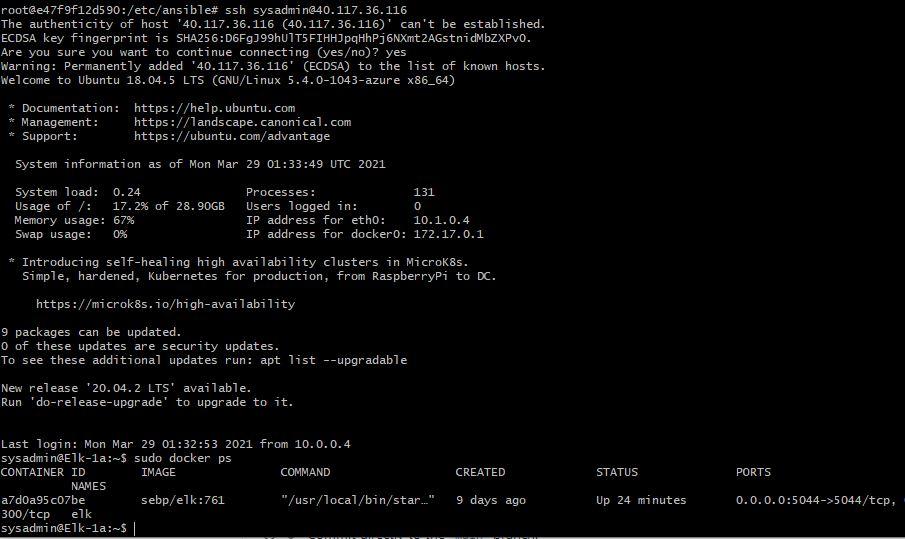

# DU-Cybersecurity
Repository to store any scripts, diagrams or other documentation that you have worked on throughout the Cybersecurity program
## Automated ELK Stack Deployment

The files in this repository were used to configure the network depicted below.

These files have been tested and used to generate a live ELK deployment on Azure. They can be used to either recreate the entire deployment pictured above. Alternatively, select portions of the _____ file may be used to install only certain pieces of it, such as Filebeat.

  - _TODO: Enter the playbook file._

This document contains the following details:
- Description of the Topologu
- Access Policies
- ELK Configuration
  - Beats in Use
  - Machines Being Monitored
- How to Use the Ansible Build

### Description of the Topology

The main purpose of this network is to expose a load-balanced and monitored instance of DVWA, the D*mn Vulnerable Web Application.

Load balancing ensures that the application will be highly available, in addition to restricting unauthorized access to the network.
- Load balancers establish redundancy to improve server availability.

Integrating an ELK server allows users to easily monitor the vulnerable VMs for changes to the log files and system performance.
- What does Filebeat watch for? Changes in system files, allowing real-time detection of important changes
- What does Metricbeat record? Monitors at  aless granular level, allowing anaylsis of log data at specific moments in time

The configuration details of each machine may be found below.

| Name     | Function          | IP Address    | Operating System |
|----------|-------------------|---------------|------------------|
| Jump-Box | Gateway           | 10.0.0.1      | Linux            |
| Web-1    | Webserver         | 10.0.0.5      | Linux            |
| Web-2    | Webserver         | 10.0.0.6      | Linux            |
| Web-3    | Webserver         | 10.0.0.7      | Linux            |
| ELK-1    | ELK Monitoring    | 10.1.0.4      | Linux            |

### Access Policies

The machines on the internal network are not exposed to the public Internet. 

Only the Jump-Box machine can accept connections from the Internet. Access to this machine is only allowed from the following IP addresses:
- 154.27.127.71

Machines within the network can only be accessed by the Jump_Box
- Machine 154.27.127.71 is allowed access to the ELK-1 VM via port 5601.

A summary of the access policies in place can be found in the table below.

| Name     | Publicly Accessible | Allowed IP Addresses |
|----------|---------------------|----------------------|
| Jump-Box | Yes                 | 154.27.127.71        |
| Web-1    | No                  | 168.62.19.204        |
| Web-2    | No                  | 168.62.19.204        |
| Web-3    | No                  | 168.62.19.204        |
| ELK-1    | Yes                 | 154.27.127.71        |

### Elk Configuration

Ansible was used to automate configuration of the ELK machine. No configuration was performed manually, which is advantageous because...
- What is the main advantage of automating configuration with Ansible? The main advantage is that the same configuration can be automated and deployed to multiple machines.

The playbook implements the following tasks:
- Docker and Ansible were installed on the Jump-Box VM
- ELK VM was setup
- Playbooks were ran using ansible-playbook command

The following screenshot displays the result of running `docker ps` after successfully configuring the ELK instance.

### Target Machines & Beats
This ELK server is configured to monitor the following machines:
- 10.0.0.5
- 10.0.0.6
- 10.0.0.7

We have installed the following Beats on these machines:
- filebeat-7.4.0-amd64.deb

These Beats allow us to collect the following information from each machine:
- _TODO: In 1-2 sentences, explain what kind of data each beat collects, and provide 1 example of what you expect to see. E.g., `Winlogbeat` collects Windows logs, which we use to track user logon events, etc._

### Using the Playbook
In order to use the playbook, you will need to have an control node already configured. Assuming you have such a control node provisioned: 

SSH into the control node and follow the steps below:
- Copy the FIlebeat-configuration.yml file to ELK VM.
- Update the hosts file to include webservers 10.0.0.5, 10.0.0.6, 10.0.07
- Run the playbook, and navigate to the Jump_Box to check that the installation worked as expected.

_TODO: Answer the following questions to fill in the blanks:_
- _Which file is the playbook? Where do you copy it?_
- _Which file do you update to make Ansible run the playbook on a specific machine? How do I specify which machine to install the ELK server on versus which to install Filebeat on?
- Filebeat is installed on the ELK server
- _Which URL do you navigate to in order to check that the ELK server is running?
- http://40.114.112.73:5601/app/kibana

